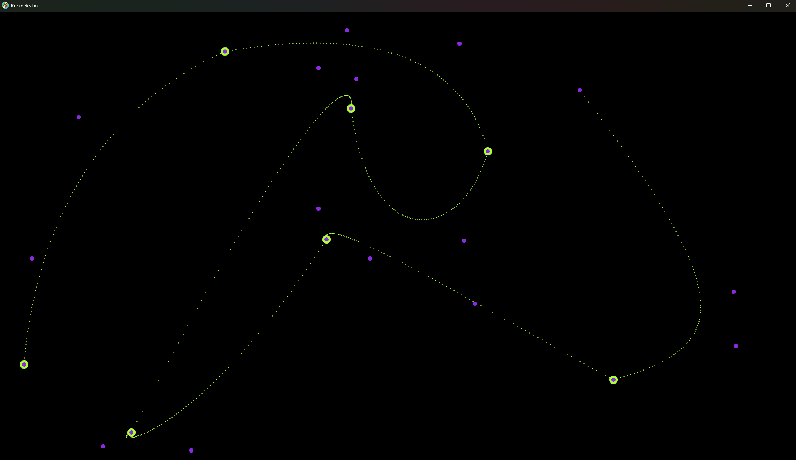
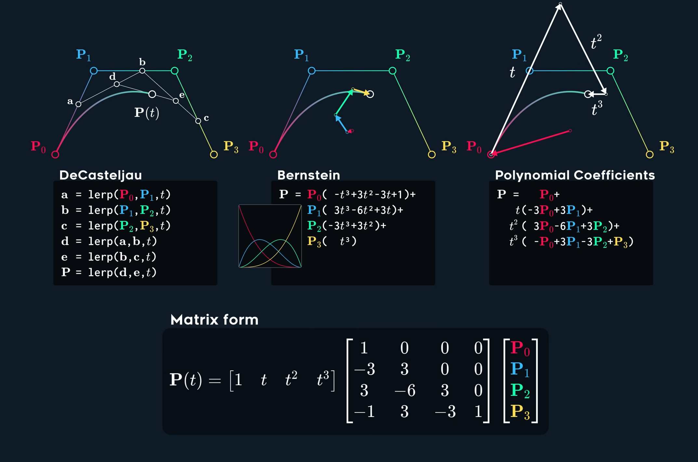

# Curvas de Bezier





# [Algoritmos](./src/math/polynomial_eval.rs)

Son una representación matemática de curvas suaves y continuas. Se utilizan en gráficos por computadora para modelar formas y en diseño asistido por computadora para representar curvas y superficies.



## Algoritmo de Horner
```rust
pub fn horner(coefficients: &[f64], x: f64) -> f64 {
    let mut result = coefficients[0];  // The first coefficient is the highest power
    coefficients.iter().skip(1).for_each(|&coefficient| result = result * x + coefficient);
    result
}
```

## Algoritmo de Bernstein
```rust
fn bernstein(n: usize, i: usize, t: f64) -> f64 {
    let mut coeff = 1.0;
    let mut j = i;
    let mut k = n - i;

    while j > 0 {
        coeff *= t;
        j -= 1;
    }

    while k > 0 {
        coeff *= 1.0 - t;
        k -= 1;
    }

    coeff * binomial_coeff(n, i) as f64
}

fn binomial_coeff(n: usize, k: usize) -> usize {
    let mut res = 1;
    for i in 0..k {
        res *= n - i;
        res /= i + 1;
    }
    res
}
```

## Algoritmo de Casteljau
```rust
// Casteljau algorithm for evaluating Bézier curves
fn casteljau(points: &[Point], t: f64) -> Point {
    let mut temp_points = points.to_vec();
    for _ in 1..points.len() {
        for i in 0..(temp_points.len() - 1) {
            temp_points[i] = Point::lerp(&temp_points[i], &temp_points[i + 1], t);
        }
        temp_points.pop();
    }
    temp_points[0]
}

// Point struct
#[derive(Debug, Clone, Copy)]
struct Point {
    x: f64,
    y: f64,
}

impl Point {
    fn lerp(p1: &Point, p2: &Point, t: f64) -> Point {
        Point {
            x: p1.x + (p2.x - p1.x) * t,
            y: p1.y + (p2.y - p1.y) * t,
        }
    }
}
```

## Forma Matricial (t)

La implementacion está en el archivo [`bezier.rs`](./src/math/bezier.rs).

Este algoritmo depende de algunas transformaciones matriciales para calcular los puntos de la curva de Bezier. Estas operaciones están definidas en la estructura `Matrix` y se pueden encontrar en el archivo [`matrix.rs`](./src/math/matrix.rs).

```rust
fn bezier_at(t: f32, points: &Vec<Point2>) -> Point2 {
    // Validate the input
    assert!(t >= 0.0 && t <= 1.0, "The time variable `t` must be between 0 and 1");
    assert!(points.len() == 4, "The Cubic Bezier curve requires 4 control points");

    // Create a matrix with the control points
    let t_vec = Matrix::new(vec![
        // (3..=0).map(|n| t.powi(n as i32) as f64).collect::<Vec<f64>>()
        vec![t.powi(3) as f64, t.powi(2) as f64, t as f64, 1.0]
    ]);

    // Create the bezier matrix
    let bezier_matrix = t_vec * b3_matrix();  // Multiply the t vector by the bezier matrix

    // multiply the bezier matrix by the control points matrix
    let x_val: Vec<f64> = points.iter().map(|point| point.x as f64).collect();
    let y_val: Vec<f64> = points.iter().map(|point| point.y as f64).collect();

    // Calculate the x and y values
    let x = bezier_matrix.clone() * Matrix::new(vec![x_val]).transpose();
    let y = bezier_matrix.clone() * Matrix::new(vec![y_val]).transpose();

    Point2::new(x.data[0][0] as f32, y.data[0][0] as f32)  // Return the point [x, y
}
```